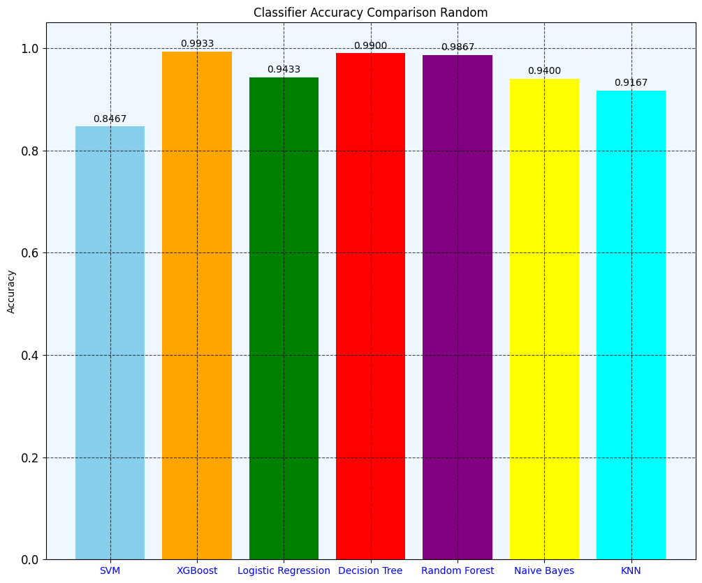
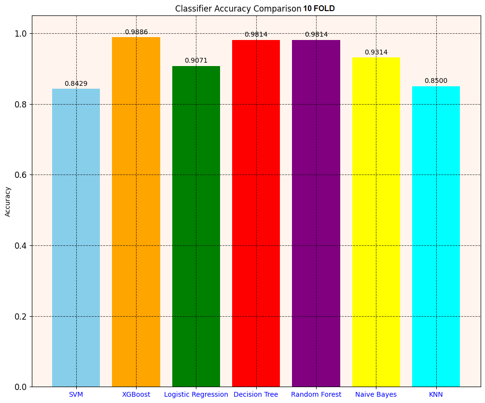

# Three-Stage Diabetes Prediction Using Machine Learning

**Project Overview:**

This project predicts the likelihood of diabetes at three different stages using machine learning algorithms. The dataset contains various medical features, and the model classifies the diabetes progression, helping healthcare professionals make early diagnoses.

## Features 🌟
- **Data Preprocessing:** Cleaning and preparing medical data for training models.
- **Multiple Stages:** Classification of diabetes into three stages.
- **Machine Learning Algorithms:** Implementation of models like Logistic Regression, Random Forest, and Support Vector Machines.
- **Accuracy Metrics:** Evaluation of models using accuracy, precision, recall, and F1 score.

---

## Technology Stack 🔧
- **Python**: For data processing, machine learning, and evaluation.
- **Libraries**: 
  - Pandas for data manipulation
  - Scikit-learn for machine learning models
  - Matplotlib & Seaborn for data visualization
- **Google Colab**: For running the code interactively.

---

## Dataset 📊

The dataset consists of medical features that can be used to predict the stage of diabetes:
- **Gender**: The gender of the individual.
- **AGE**: Age of the individual.
- **Urea**: Urea levels.
- **Cr**: Creatinine levels.
- **HbA1c**: Hemoglobin A1c levels.
- **Chol**: Cholesterol levels.
- **TG**: Triglycerides levels.
- **HDL**: High-density lipoprotein levels.
- **LDL**: Low-density lipoprotein levels.
- **VLDL**: Very low-density lipoprotein levels.
- **BMI**: Body Mass Index.
- **CLASS**: The stage of diabetes (target variable).

---

## Model Workflow 🔄

1. **Data Collection**: 
   - The dataset is collected and stored in a CSV file with the columns: 'Gender', 'AGE', 'Urea', 'Cr', 'HbA1c', 'Chol', 'TG', 'HDL', 'LDL', 'VLDL', 'BMI', 'CLASS'.
   
2. **Data Preprocessing**:
   - Handle missing values, encode categorical variables, and scale numerical features.
   - Split the dataset into training and testing sets (e.g., 80% training, 20% testing).

3. **Model Selection**:
   - Implement multiple machine learning models like:
     - **Logistic Regression**: A simple and interpretable model.
     - **Random Forest**: A robust, ensemble model.
     - **Support Vector Machines**: A model suited for classification tasks with a complex decision boundary.

4. **Model Training**:
   - Train each model using the training dataset and evaluate performance using cross-validation.

5. **Evaluation**:
   - Evaluate the models using metrics like **accuracy**, **precision**, **recall**, and **F1 score**.

6. **Prediction**:
   - Use the trained model to predict the stage of diabetes for new data points.

---

## Screenshots 📸

<div align="center">
  
  </div>
  <div align="center">
  
  </div>
 


---

## Conclusion 🎯

In this project, we demonstrated how machine learning can be leveraged to predict the stage of diabetes using medical data. By utilizing models such as Logistic Regression, Random Forest, and Support Vector Machines, we were able to develop an effective prediction system. The choice of model depends on factors like interpretability and accuracy, with the Random Forest model typically providing the best results.

This project can assist healthcare professionals in early diagnosis and monitoring of diabetes progression. Future improvements could involve incorporating more advanced algorithms or additional features to increase the prediction accuracy.

---

## How to Run on Google Colab 🖥️

1. **Clone the Repository**:
   ```bash
   !git clone https://github.com/Amai-Mask/diabetes-prediction.git
